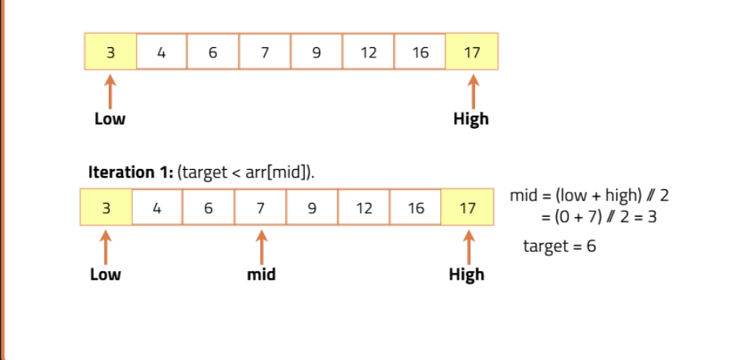

# 🔍 Algorithm: Binary Search : Search X in sorted Array


## 1. Divide the Search Space into 2 Halves
To divide the search space, we need to find the middle point:
```python
mid = (low + high) // 2   # '//' refers to integer division
```
## 2. Compare the Middle Element with the Target
We can observe three different cases:

- **Case 1:** `arr[mid] == target`  
  → Target found. Return the index of the target.

- **Case 2:** `target > arr[mid]`  
  → Target lies in the **right half**. Next search space = right half.

- **Case 3:** `target < arr[mid]`  
  → Target lies in the **left half**. Next search space = left half.

---

## 3. Trim Down the Search Space
Based on the probable location of the target:

- If target is in the **left half** → set `high = mid - 1`.
- If target is in the **right half** → set `low = mid + 1`.

Thus, the search space keeps shrinking until the target is found or the space is exhausted.